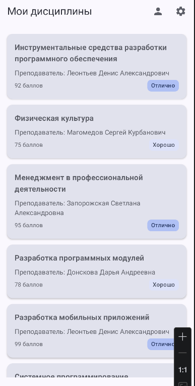
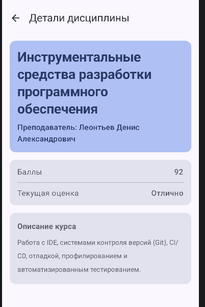
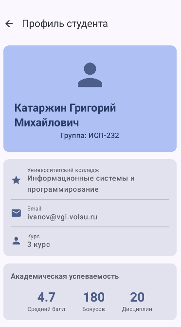
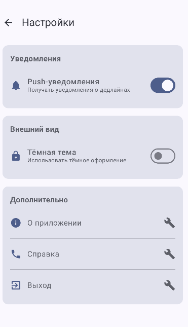

# Student Planner

Приложение "Студенческий планер" для управления учебными дисциплинами. Позволяет просматривать список предметов, изучать подробную информацию о каждом курсе и отслеживать успеваемость. Реализована навигация между экранами с передачей данных и сохранением состояния.

## Реализованные экраны

1. **HomeScreen** — главный экран со списком всех учебных дисциплин в виде карточек
2. **DetailsScreen** — экран детальной информации о выбранной дисциплине (название, преподаватель, баллы, оценка, описание)
3. **ProfileScreen** — экран профиля студента с личной информацией и академической статистикой
4. **SettingsScreen** — экран настроек приложения с переключателями уведомлений и темы

## Используемые технологии

- Kotlin
- Jetpack Compose
- Navigation Compose
- Material 3 Design

## Схема навигации

```
HomeScreen (startDestination)
    ├──> [клик по дисциплине] -> DetailsScreen (с параметром subjectId)
    ├──> [кнопка Профиль] -> ProfileScreen
    └──> [кнопка Настройки] -> SettingsScreen

DetailsScreen -> [кнопка Назад] -> HomeScreen
ProfileScreen -> [кнопка Назад] -> HomeScreen
SettingsScreen -> [кнопка Назад] -> HomeScreen
```

## Скриншоты

### Главный экран


### Экран деталей дисциплины


### Экран профиля


### Экран настроек


---

# Контрольные вопросы

## 1. Что такое NavController и для чего он используется?

NavController — это объект, который управляет навигацией между экранами приложения. Он контролирует стек экранов (back stack), выполняет переходы между destination'ами и обрабатывает кнопку "Назад".

Создание через `rememberNavController()` важно, потому что эта функция сохраняет экземпляр NavController при рекомпозиции UI. Если создавать его напрямую, при каждом обновлении интерфейса будет создаваться новый контроллер, что приведёт к потере состояния навигации и сбросу back stack.

## 2. Как передать параметр в маршрут навигации?

Процесс передачи параметра:
1. В sealed class Screen определяем маршрут с плейсхолдером: `object Details : Screen("details/{subjectId}")`
2. Создаём вспомогательную функцию для формирования маршрута: `fun createRoute(subjectId: String) = "details/$subjectId"`
3. В NavHost регистрируем маршрут с указанием типа аргумента через `navArgument`
4. Извлекаем параметр в composable через `backStackEntry.arguments?.getString("subjectId")`
5. Для перехода вызываем `navController.navigate(Screen.Details.createRoute("123"))`

Разница между параметрами:
- **Обязательные**: указываются в пути как `{paramName}`, должны быть переданы обязательно
- **Опциональные**: указываются в query-параметрах `?key={value}`, имеют defaultValue и могут отсутствовать

## 3. Зачем использовать sealed class для маршрутов?

Преимущества sealed class:
- Типобезопасность: компилятор проверяет все возможные варианты маршрутов
- Централизованное хранение всех routes в одном месте
- Автодополнение в IDE при использовании маршрутов
- Защита от опечаток в строковых литералах

Пример ошибки без sealed class: если в одном месте написать `navController.navigate("detals")` с опечаткой, а маршрут зарегистрирован как `"details"`, приложение упадёт или не найдёт экран. С sealed class такая ошибка невозможна — компилятор не позволит использовать несуществующий маршрут.

## 4. Что такое Back Stack и как им управлять?

Back Stack — это стек посещённых экранов, работающий по принципу LIFO (Last In First Out).

Схема back stack для Home → Profile → Settings:
```
| Settings  ← текущий экран
| Profile
| Home      ← начальный экран
```

При вызове `popBackStack()` на экране Settings:
- Settings удаляется из стека
- Текущим становится Profile
- Пользователь видит экран Profile

## 5. Как работает startDestination в NavHost?

`startDestination` определяет первый экран, который отображается при запуске приложения. В данном случае это `Screen.Home.route` ("home").

Изменить startDestination динамически можно, передавая разные значения в параметр `startDestination` при создании NavHost. Например, можно проверять авторизацию пользователя и направлять его либо на экран входа, либо на главный экран.

## 6. Что произойдёт, если навигировать на несуществующий маршрут?

NavController выбросит исключение `IllegalArgumentException`, если маршрут не зарегистрирован в NavHost.

Обработка ситуации:
- Использовать sealed class для предотвращения ошибок на этапе компиляции
- Оборачивать навигацию в try-catch блок
- Проверять существование маршрута перед навигацией
- Использовать граф навигации с fallback-маршрутом для неизвестных путей

## 7. Зачем нужен параметр launchSingleTop в навигации?

`launchSingleTop` предотвращает создание дубликатов экрана на вершине back stack. Без этого параметра многократный переход на один и тот же экран создаст несколько его копий в стеке.

Пример проблемы: пользователь находится на DetailsScreen дисциплины "Математика", переходит на HomeScreen, затем снова выбирает "Математику". Без `launchSingleTop` в стеке будет два одинаковых DetailsScreen. При нажатии "Назад" пользователь увидит тот же экран вместо возврата на Home.

Влияние на back stack: `launchSingleTop` проверяет, является ли целевой экран уже верхним в стеке. Если да — существующий экран переиспользуется вместо создания нового.